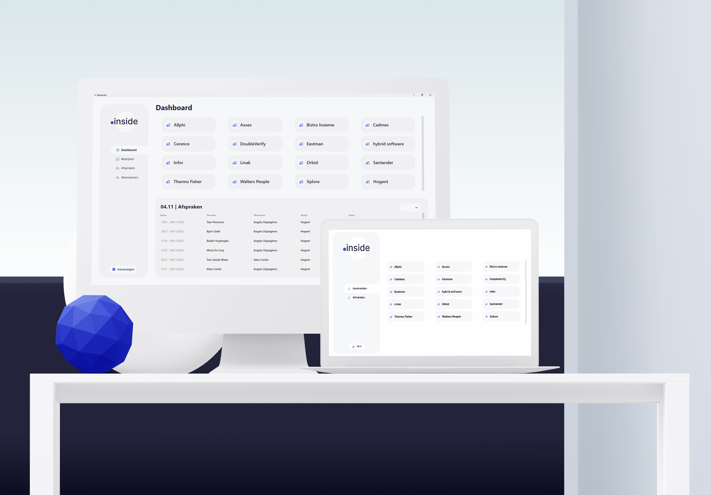

# **.inside**
Een tool gemaakt door Wout, Bjorn, Stan & Balder in opdracht voor Allphi
binnen het Graduaat Programmeren HoGent.

## De Opdracht
Een bedrijvenpark met een centrale receptie wil een applicatie die de bezoekers van het bedrijvenpark kan registreren. Dit is nodig in kader van de brandveiligheid, op deze manier weet men ten allen tijde wie er aanwezig is op de site. Iedereen die op bezoek komt bij één van de bedrijven moet zich eerst aanmelden aan de receptie. Om dit zo vlug mogelijk te laten verlopen krijgen de bezoekers de mogelijkheid om zichzelf aan te melden via een touchscreen die voorzien wordt aan de inkom. Via het touchscreen kunnen ze hun eigen gegevens en de persoon waarmee ze een afspraak hebben ingeven. Bij het vertrekkunnen de bezoekers zich terug uitschrijven via hetzelfde touchscreen. Wij houden hierbij zeker rekening met de privacy van de bezoekers met betrekking to de GDPR.

## Onze Oplossing
Onze oplossing biedt een toegankelijk, makkelijk te onderhouden en uitbreidbaar systeem in combinatie met een gebruiksvriendelijke user interface.

Onze backend maakt gebruik van een REST service om zodoende een optimale compatibiliteit te bieden. Dit zorgt ervoor dat we opeen eenvoudige manier een website kunnen opzetten voor .inside die API calls maakt naar onze backend.

Bovendien heeft het gebruikmaken van een REST een significant voordeel, zo kan men centraal gaan runnen. 
De host van de server kan op meerdere platformen draaien zonder probleem, aangezien de server cross platform is.
